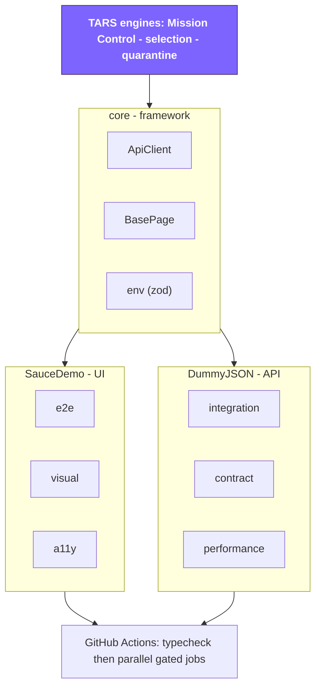

<div align="center">

# 🤖 TARS

### Test Automation & Reliability System

**An autonomous quality-engineering platform: seven testing disciplines in one
typed Playwright + TypeScript codebase, built and guarded by an AI principal-SDET.**

[](https://github.com/dev-shubhamsingh/playwright-e2e-framework/actions/workflows/playwright.yml)
[](https://playwright.dev/)
[](https://www.typescriptlang.org/)
[](https://opensource.org/licenses/MIT)
[](https://prettier.io/)

</div>

**TARS** is what happens when you encode a principal SDET's _judgment_ into a
system. It spans the disciplines real quality teams own — **UI e2e, API
integration, contract, performance, security, visual, and accessibility** — all
strictly typed, all behind enforced CI gates. And it doesn't just run tests: a
built-in engine analyzes every run for flake, selects the tests a change
actually affects, and quarantines instability.

Two real systems are exercised end to end:

- **SauceDemo** ([saucedemo.com](https://www.saucedemo.com)) — UI e2e, visual,
  and accessibility.
- **DummyJSON** ([dummyjson.com](https://dummyjson.com)) — API integration,
  contract, and performance.



> ### 🤖 Meet TARS — the brain
>
> This isn't a test repo with a clever name. **[TARS](./tars)** is an autonomous
> QE agent: governance rules that hold every change to a principal bar, plus
> **engines that act** — a Mission Control reporter, test-impact selection, and
> auto-quarantine. It even pushes back: it deferred a cargo-cult abstraction,
> swapped a wrong test runner mid-build, and baselined a _real_ accessibility
> bug it found instead of hiding it. **[→ See what TARS does](./tars)**

---

## Highlights

- **TypeScript, strict mode** throughout — typed page objects, clients, fixtures.
- **Page Object Model** (UI) and **resource clients** (API) — the same
  encapsulation idea on both sides.
- **Reusable HTTP core** — `ApiClient` with typed request helpers, retry/backoff
  on transient statuses, and request/response captured into the report.
- **Schema-validated API contracts** — [zod](https://zod.dev) schemas double as
  TypeScript types via `z.infer`.
- **Custom fixtures** — page objects and API clients are dependency-injected;
  auth runs once and is reused.
- **Typed, validated configuration** — one zod-checked `env` that fails fast on
  misconfiguration; no scattered `process.env`.
- **Quality gates** — ESLint (flat config + Playwright plugin), Prettier, and a
  husky + lint-staged pre-commit hook.
- **Cross-browser** — Chromium, Firefox, WebKit, plus mobile viewports.
- **Path aliases** — clean imports (`@core/*`, `@saucedemo/*`, `@dummyjson/*`,
  `@shared/*`).
- **Rich diagnostics** — traces, screenshots, and video on failure.

---

## Project Structure

```
.
├── src/
│   ├── core/                   # app-agnostic framework code
│   │   ├── config/             # env.ts — typed, zod-validated environment
│   │   ├── http/               # ApiClient base (retry, report attachments)
│   │   └── ui/                 # BasePage (page handle + baseURL-relative goto)
│   ├── shared/utils/           # helpers + Faker test-data factory
│   ├── saucedemo/              # UI domain
│   │   ├── pages/              # Page Object Model classes
│   │   ├── fixtures/           # base + auth fixtures
│   │   └── data/               # users, products test data
│   └── dummyjson/              # API domain
│       ├── clients/            # AuthClient, ProductsClient (extend ApiClient)
│       ├── fixtures/           # api fixtures (clients + authed request)
│       ├── schemas/            # zod response contracts
│       └── config.ts           # domain view over env
├── tests/
│   ├── saucedemo/
│   │   ├── e2e/                # UI spec files
│   │   └── auth.setup.ts       # logs in once, saves session
│   └── dummyjson/
│       └── api/                # API spec files
├── playwright.config.ts        # projects, browsers, reporters
├── eslint.config.mjs           # flat ESLint config
├── tsconfig.json               # strict + path aliases
└── .github/workflows/          # CI: type-check + full suite on push/PR
```

Test types for a domain live under `tests/<domain>/<type>/`. Planned next:
`tests/dummyjson/{contract,perf}` for Pact and performance suites.

### Path aliases

| Alias          | Path                |
| -------------- | ------------------- |
| `@core/*`      | `src/core/*`        |
| `@config/*`    | `src/core/config/*` |
| `@saucedemo/*` | `src/saucedemo/*`   |
| `@dummyjson/*` | `src/dummyjson/*`   |
| `@shared/*`    | `src/shared/*`      |

---

## Getting Started

### Prerequisites

- Node.js 18+
- npm

### Install

```bash
npm install
npx playwright install
```

### Configure (optional)

```bash
cp .env.example .env
```

All values have sensible public defaults, so the suite runs out of the box.
Configuration is read through a single typed, zod-validated loader
(`src/core/config/env.ts`) that fails fast with a readable message if a value is
invalid.

| Variable             | Default                     | Used by         |
| -------------------- | --------------------------- | --------------- |
| `BASE_URL`           | `https://www.saucedemo.com` | SauceDemo UI    |
| `TEST_USER`          | `standard_user`             | SauceDemo login |
| `TEST_PASSWORD`      | `secret_sauce`              | SauceDemo login |
| `API_BASE_URL`       | `https://dummyjson.com`     | DummyJSON API   |
| `DUMMYJSON_USERNAME` | `emilys`                    | DummyJSON auth  |
| `DUMMYJSON_PASSWORD` | `emilyspass`                | DummyJSON auth  |

---

## Running Tests

```bash
# Everything (all projects)
npm test

# API suite only (no browser)
npm run test:api

# Tag-filtered suites
npm run test:smoke        # fast critical-path subset (@smoke)
npm run test:regression   # full regression set (@regression)

# UI: headed / interactive / debug
npm run test:headed
npm run test:ui
npm run test:debug

# A single project
npx playwright test --project=api
npx playwright test --project=authenticated
npx playwright test --project=login

# A single spec
npx playwright test tests/dummyjson/api/products.spec.ts

# View the HTML report after a run
npm run report

# Generate and open the Allure report (requires allure CLI)
npm run allure:generate
npm run allure:open
```

### Test tags

Tests are tagged so suites can be filtered with `--grep`:

- `@smoke` — one representative happy-path test per feature area (UI + API).
  A fast confidence check.
- `@regression` — the full suite. `@smoke` is a strict subset, so smoke tests
  carry both tags.

```bash
npx playwright test --grep @smoke               # smoke only
npx playwright test --grep @regression          # everything
npx playwright test --grep "@smoke" --project=api   # compose with projects
```

### Quality gates

```bash
npm run typecheck     # tsc --noEmit
npm run lint          # eslint .
npm run lint:fix      # eslint . --fix
npm run format        # prettier --write .
npm run format:check  # prettier --check .
```

A husky `pre-commit` hook runs lint-staged, auto-fixing staged files with ESLint
and Prettier before each commit.

---

## Continuous Integration

GitHub Actions (`.github/workflows/playwright.yml`) runs tests in three tiers:

**`typecheck` — every push / PR:** runs first, blocks all other jobs. Fast gate
that prevents broken types from wasting browser minutes.

**`test-ui`, `test-api`, `test-contract`, and `test-a11y` — every push / PR, run
in parallel after `typecheck`:** the required jobs that must stay green to
merge. Each has its own timeout and Chromium-only install where needed; jobs
upload their Playwright HTML report, Allure results, or pact files as separate
artifacts (retained 14 days).

| Job             | Runs                     | Timeout |
| --------------- | ------------------------ | ------- |
| `test-ui`       | `login`, `authenticated` | 20 min  |
| `test-api`      | `api`                    | 10 min  |
| `test-contract` | Pact suite (Jest)        | 10 min  |
| `test-a11y`     | `a11y` (axe-core)        | 15 min  |

**`cross-browser` matrix — nightly + `workflow_dispatch` only:**
Firefox, WebKit, mobile-chrome, mobile-safari — one job per browser,
`fail-fast: false`. Non-gating; cross-browser coverage is preserved without
blocking PRs while WebKit/mobile-on-CI flakiness is being investigated.

CI behaviour from `playwright.config.ts`: `forbidOnly` enforced, 2 retries on
failure, 1 worker for deterministic runs.

---

## Playwright Projects

| Project                         | What it does                                                      |
| ------------------------------- | ----------------------------------------------------------------- |
| `setup`                         | Logs in once via `LoginPage`, saves session to `.auth/`.          |
| `login`                         | Unauthenticated UI login-flow tests.                              |
| `authenticated`                 | UI tests on Chromium, starting logged in (`storageState`).        |
| `firefox`, `webkit`, `mobile-*` | Same authenticated UI tests across browsers and mobile viewports. |
| `api`                           | DummyJSON API tests — no browser, own `baseURL`.                  |

UI projects ignore `**/dummyjson/**`; the `api` project matches only API specs.

---

## The seven disciplines

Each has its own patterns, its own failure modes, and its own reference doc. The
distinctive decision in each is below; the depth is one link away.

### UI end-to-end — SauceDemo

Page Object Model on a two-level base (`BasePage` → `SauceDemoPage`), locators as
`readonly` property initializers, `testIdAttribute: 'data-test'`. Auth happens
**once**: a `setup` project drives the real `LoginPage` and saves `storageState`,
which every authenticated project reloads — so no test ever logs in, and each gets
a fresh context with a clean cart and needs no teardown.

→ [`e2e-playwright.md`](./.claude/skills/test-author/references/e2e-playwright.md)

### API integration — DummyJSON

Every resource client extends `@core/http` `ApiClient` (typed verbs, retry with
backoff on 429/502/503/504 honouring `Retry-After`, request/response attached to
the report). Clients return the raw `APIResponse`, so the **spec** owns the
assertions — and every response is asserted twice: the status code explicitly, and
the body parsed through its zod schema. One half without the other lets a `200`
carrying an error payload pass.

There is no owned datastore, so the deepest observable boundary is HTTP + schema.
Writes against the target are simulated and never persist — stated rather than
papered over.

→ [`api-and-schema.md`](./.claude/skills/test-author/references/api-and-schema.md)

### Contract — Pact (consumer)

`PactV3` consumer contracts run by **Jest**, the one place Jest is correct here
(the mock-server lifecycle needs a `describe`/`it` harness). Matchers, never
literals: the contract claims "a string field `title`", not a specific product
name. Runs offline, so it is the one suite immune to a target outage.

**Consumer-side only** — no broker, no provider verification, and none is
achievable against a third-party public API.

→ [`contract-pact.md`](./.claude/skills/test-author/references/contract-pact.md)

### Performance — k6

Load, stress, spike, and soak scripts in TypeScript. **Thresholds are the
assertion** — `p(95)<500`, `http_req_failed rate<0.01` — because a breached
threshold makes k6 exit non-zero. A script without them measures without testing.

The interesting constraint: k6's loader requires explicit `.ts` extensions on
local imports, which TypeScript only permits with `allowImportingTsExtensions`,
which requires `noEmit`. Both are set, and correct anyway — nothing here compiles.

Manual dispatch only, with conservative defaults: the target is a shared public
API, and generating automated load against it would be abusive.

→ [`performance.md`](./.claude/skills/test-author/references/performance.md)

### Security — OWASP ZAP

Passive baseline scan: spiders the target and analyses the responses it receives.
No attack payloads, manual dispatch, non-gating, `.zap/rules.tsv` tuning three
low-signal rules to `IGNORE` with a reason each.

**Active scanning is out of scope and will stay that way.** Sending crafted attack
traffic at infrastructure you don't own and aren't authorised to test is
unauthorised activity — however permissive the demo site looks.

→ [`security-zap.md`](./.claude/skills/test-author/references/security-zap.md)

### Visual regression — Playwright snapshots

`toHaveScreenshot` on three deliberately _stable_ pages, animations disabled,
`maxDiffPixelRatio: 0.01` to absorb antialiasing without hiding a real change.

**Not gated in CI**, and the reason is in the filenames: baselines are
`*-visual-darwin.png`. A Linux runner would fail every snapshot on font rendering
alone. Gating it means maintaining a second Linux baseline set — real work, not
done, and not pretended.

→ [`visual-and-a11y.md`](./.claude/skills/test-author/references/visual-and-a11y.md)

### Accessibility — axe-core

WCAG 2.0/2.1 A+AA, gated in CI (axe output is platform-independent, unlike pixels).

The suite **found a real defect**: SauceDemo's product-sort `<select>` has no
accessible name (`select-name`, critical). We can't fix a third-party app, so the
choice was: ignore all criticals (coverage theatre), disable the rule globally
(blinds it everywhere), or baseline that specific rule id on that specific page.

The third. `KNOWN_CRITICAL` is keyed per page, holds specific rule ids, and each
carries a comment — so the suite still fails on any **new** critical. A regression
guard, not a rubber stamp. If the target ever fixes it, the suite goes red and the
entry gets deleted.

→ [`visual-and-a11y.md`](./.claude/skills/test-author/references/visual-and-a11y.md)

## TARS

**TARS** (Test Automation & Reliability System) is the quality-engineering layer
this repository ships, not a nickname for it. It has three parts, all committed:

- **Canon** — [`tars/persona.md`](./tars/persona.md),
  [`tars/architecture.md`](./tars/architecture.md), and
  [`tars/test-patterns.md`](./tars/test-patterns.md) hold every change, human or
  agent, to a principal bar. [`CLAUDE.md`](./CLAUDE.md) is the entry point.
- **Engines** — a Mission Control reporter on every run, risk-based test
  selection from a diff, an auto-quarantine ledger, and a ledger consumer that
  surfaces it in CI. [`→ tars/`](./tars)
- **Agent skills** — four skills in [`.claude/skills/`](./.claude/skills) that
  turn the canon into workflows: `test-plan`, `test-author`, `test-review`,
  `test-ci-triage`. [`→ guide`](./docs/TESTING-SKILLS.md)

---

## Tech Stack

- Playwright Test
- TypeScript (strict)
- zod (response schema validation)
- Faker (test data generation)
- dotenv (environment config)
- Allure (rich test reporting via allure-playwright)
- Pact (`@pact-foundation/pact`) + Jest (consumer contract testing)
- k6 (performance: load, stress, spike, soak — TypeScript scripts)
- OWASP ZAP (passive security baseline scan via GitHub Actions)
- axe-core (`@axe-core/playwright`) for accessibility (WCAG 2.1 AA) scans
- ESLint + Prettier + husky + lint-staged (quality gates)

---

## Test levels — and what actually gates

Honest status. A discipline being present is not the same as it guarding a merge.

| Level             | Harness                             | Gates a PR? | Note                                                                 |
| ----------------- | ----------------------------------- | ----------- | -------------------------------------------------------------------- |
| Framework unit    | `@playwright/test` (`unit` project) | ✅          | The framework's own code — helpers, `ApiClient`, `env`, TARS engines |
| API integration   | `@playwright/test`                  | ✅          | Status + zod schema on every response                                |
| Contract          | Pact + Jest                         | ✅          | **Consumer-side only** — no broker, no provider verification         |
| UI end-to-end     | `@playwright/test`                  | ✅          | Sharded ×2, blob reports merged into one report + brief              |
| Accessibility     | `@axe-core/playwright`              | ✅          | WCAG 2.0/2.1 A+AA; fails on _new_ criticals                          |
| Visual regression | `toHaveScreenshot`                  | ❌          | Baselines are macOS-only; a Linux runner would fail on antialiasing  |
| Performance       | k6                                  | ❌          | Manual dispatch. The target is a shared public API                   |
| Security          | OWASP ZAP baseline                  | ❌          | Manual dispatch, **passive only** — we don't own the targets         |
| Cross-browser     | Firefox / WebKit / mobile           | ❌          | Nightly. WebKit and mobile time out on the runner; undiagnosed       |

Known gaps, stated plainly rather than buried:

- **Contract testing is consumer-only.** It catches _our_ drift from what we
  declared. It cannot catch the provider changing — and against a third-party
  public API, provider verification is not achievable, not merely unbuilt.
- **Visual regression is a local guard**, not CI coverage.
- **WebKit and mobile fail on CI and pass locally.** Undiagnosed; the nightly job
  now probes target reachability to gather evidence rather than assert a cause.
- **Risk-based selection runs in CI but does not narrow the gate.** It reports
  what it would run. A selection bug that silently skips tests is worse than a
  slower pipeline, so it earns that trust before it gets it.

## Build history

The framework was built in ten phases, each adding a discipline on top of the
patterns already in place. The full log — including the tradeoffs, the things that
were deferred, and the problems that cost real time — is in
[`docs/BUILD-LOG.md`](./docs/BUILD-LOG.md).

## Contributing

See [`CONTRIBUTING.md`](./CONTRIBUTING.md) for setup, the rules that get changes
rejected, and which suites you can actually run locally. Security policy is in
[`SECURITY.md`](./SECURITY.md).
