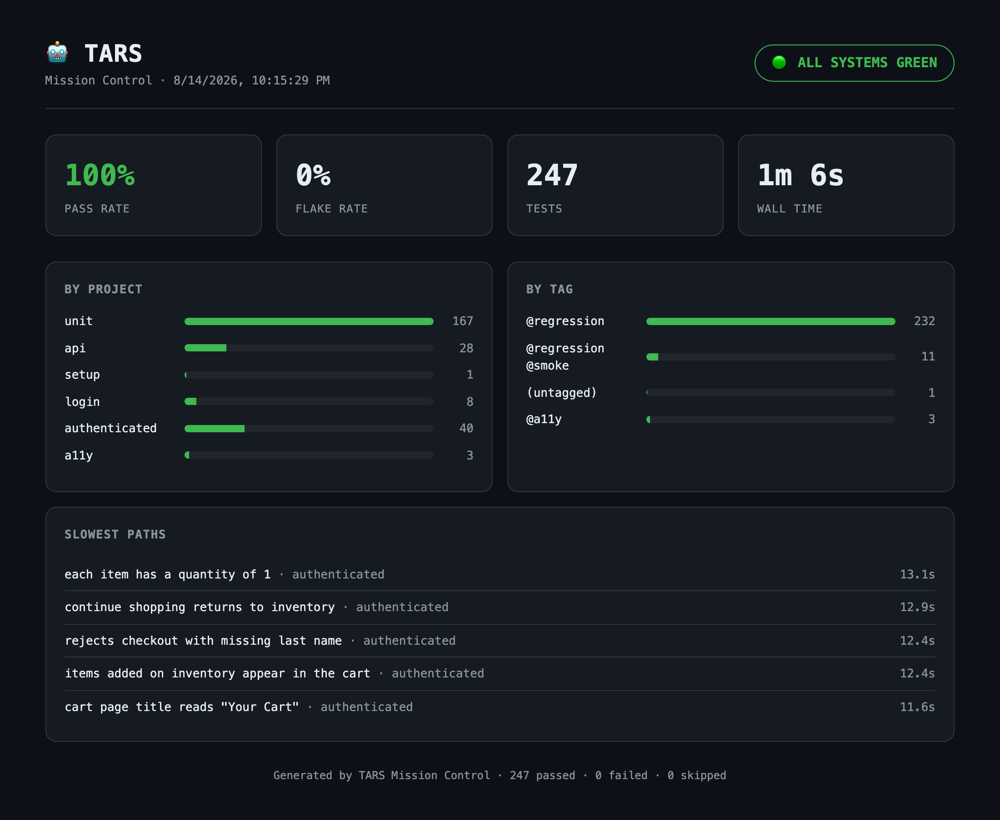
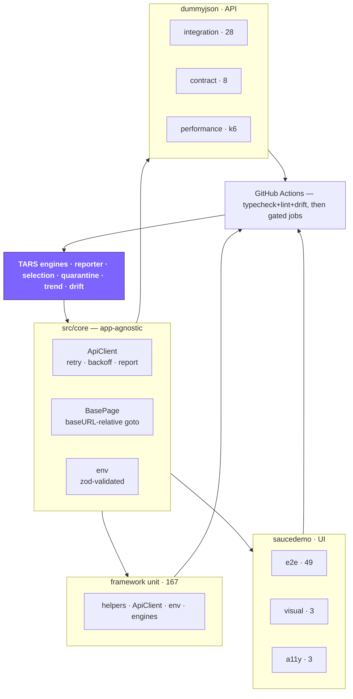

<div align="center">

# 🤖 TARS

### Test Automation &amp; Reliability System

**A Playwright + TypeScript quality-engineering platform that tests its own
quality tooling — and reports honestly on what it cannot do.**

[](https://github.com/dev-shubhamsingh/playwright-e2e-framework/actions/workflows/playwright.yml)
[](#whats-inside)
[](https://playwright.dev/)
[](https://www.typescriptlang.org/)
[](./LICENSE)

</div>

Most test frameworks measure an application. This one also measures **itself**:
a custom reporter turns every run into a quality brief, an engine maps a diff to
the tests it affects, a ledger tracks flake over time — and **167 of the 258
tests cover that tooling**, because a quality product that doesn't test its own
quality code is making a claim it can't back.

Eight suites across seven disciplines exercise two real public services, all
strictly typed, all behind CI gates that are honest about which ones actually
gate.

<div align="center">



<sub>Mission Control, generated on every run — this one covering the six projects
that run in a single Playwright invocation (contract runs on Jest, visual is
macOS-only). Published to GitHub Pages on each push to <code>main</code>.</sub>

</div>

---

## Why this isn't a Playwright starter

Strict types, page objects, and path aliases are table stakes. These four are
the reasons this repo exists.

**1 · The tooling is tested.** `ApiClient`'s retry logic, the env schema, the
selection rules, the reporter's counting — 167 unit tests, no browser, 1.4
seconds. Including the one that matters most: that a hostile `TestCase` cannot
make the reporter throw, because a reporter that breaks a run is worse than no
reporter.

**2 · Flake is a first-class signal, not a retry.** CI retries twice, which
means **a flaky test is a green test** in the exit code. Mission Control counts
Playwright's `flaky` outcome separately, so a test that only passed on attempt
two shows up as flake — then lands in a ledger with a first-seen date and a
deadline.

**3 · Risk-based selection has to earn the gate.** Mapping a diff to affected
specs is easy. Trusting it is not: a selection bug doesn't fail, it _silently
skips_. So selection runs in **shadow mode** — audited against the specs that
actually failed, exiting non-zero on a miss — and does not narrow the gate until
that audit has been clean across genuinely red builds.

**4 · The docs are gated.** ~4,000 lines of agent instructions that nothing
type-checks. `npm run tars:drift` fails the build if a doc quotes an npm script,
a `--project`, or a link that doesn't exist.

---

## Quick start

```bash
npm ci
npx playwright install --with-deps chromium

npm run test:unit        # 167 tests, ~1.4s — no browser, no network
npm run test:contract    # 8 Pact interactions — no browser, no network
npm run test:api         # 28 API tests against a live public API
```

Node 20+ ([`.nvmrc`](./.nvmrc)). Every config value has a working public default,
so the suite runs with no `.env` at all. Optional extras: `k6` for performance,
the Allure CLI for `npm run report`'s richer sibling.

```bash
npm test                 # everything
npm run test:smoke       # @smoke — one happy path per area
npm run typecheck && npm run lint && npm run format:check
```

---

## What's inside

Eight suites. **A discipline being present is not the same as it guarding a
merge**, so that column is explicit.

| Suite                 | Harness                | Tests     | Gates a PR? | The distinctive decision                                                                               |
| --------------------- | ---------------------- | --------- | ----------- | ------------------------------------------------------------------------------------------------------ |
| **Framework unit**    | `@playwright/test`     | 167       | ✅          | Playwright, not Jest — one reporting pipeline, so the reporter measures itself                         |
| **API integration**   | `@playwright/test`     | 28        | ✅          | Status **and** zod schema on every response; one without the other lets a `200` carrying an error pass |
| **UI end-to-end**     | `@playwright/test`     | 49        | ✅          | Auth happens once in a `setup` project; no test ever logs in. Sharded ×2, blobs merged into one report |
| **Contract**          | Pact + Jest            | 8         | ✅          | Matchers, never literals. Runs offline — the one suite immune to a target outage                       |
| **Accessibility**     | `@axe-core/playwright` | 3         | ✅          | Found a real WCAG defect; baselined it _per page, per rule id_, so new criticals still fail            |
| **Visual regression** | `toHaveScreenshot`     | 3         | ❌          | Baselines are macOS-only. A Linux runner fails on antialiasing — a local guard, not CI coverage        |
| **Performance**       | k6                     | 4 scripts | ❌          | Thresholds **are** the assertion. Manual dispatch: the target is a shared public API                   |
| **Security**          | OWASP ZAP              | baseline  | ❌          | Passive only. Active scanning of infrastructure we don't own is out of scope, permanently              |

**258 tests, 0% flake, 28.2s** for the 250 Playwright tests locally.

Targets are two public demo services — [SauceDemo](https://www.saucedemo.com)
(UI) and [DummyJSON](https://dummyjson.com) (API). Neither is ours, which
constrains real decisions: no database to seed, writes are simulated and never
persist, and a defect in a target is a finding to document rather than a bug to
fix.

Depth per discipline lives beside the code that implements it:
[UI](./.claude/skills/test-author/references/e2e-playwright.md) ·
[API](./.claude/skills/test-author/references/api-and-schema.md) ·
[contract](./.claude/skills/test-author/references/contract-pact.md) ·
[unit](./.claude/skills/test-author/references/framework-code.md) ·
[visual + a11y](./.claude/skills/test-author/references/visual-and-a11y.md) ·
[performance](./.claude/skills/test-author/references/performance.md) ·
[security](./.claude/skills/test-author/references/security-zap.md) ·
[CI gates](./.claude/skills/test-author/references/ci-gates.md)

---

## Architecture



```
src/
  core/          env (zod) · ApiClient · BasePage        — app-agnostic
  saucedemo/     pages/ fixtures/ data/                  — UI domain
  dummyjson/     clients/ schemas/ fixtures/             — API domain
  shared/utils/  helpers · faker test-data factory
tests/
  unit/          shared/ core/ tars/                     — the framework's own code
  saucedemo/     e2e/ visual/ a11y/ + auth.setup.ts
  dummyjson/     api/ contract/ performance/
tars/
  reporter/      TarsReporter.ts — Mission Control
  engine/        select · quarantine · ledger · shadow · trend · drift · dashboard
  *.md           the canon
.claude/skills/  four agent skills + a 13-file reference corpus
```

Path aliases (`@core/*`, `@saucedemo/*`, `@dummyjson/*`, `@shared/*`,
`@config/*`) throughout — never `../../../`. Details in
[`CONTRIBUTING.md`](./CONTRIBUTING.md).

---

## TARS — the engines

Not a nickname for the repo. Three committed parts:

**Canon** — [`persona.md`](./tars/persona.md),
[`architecture.md`](./tars/architecture.md),
[`test-patterns.md`](./tars/test-patterns.md) hold every change, human or agent,
to a principal bar. [`CLAUDE.md`](./CLAUDE.md) is the entry point.

**Engines** — they run:

```bash
npm run tars:select      # which specs does this diff actually affect?
npm run tars:shadow      # would that selection have skipped a spec that failed?
npm run tars:ledger      # surface the flake ledger (--grep / --check)
npm run tars:trend       # delta vs recent runs of the same scope
npm run tars:drift       # do the docs still describe the real repo?
npm run tars:dashboard   # render the dashboard above
# Mission Control runs automatically on every `playwright test`.
```

**Agent skills** — four skills in [`.claude/skills/`](./.claude/skills) that turn
the canon into workflows: `test-plan`, `test-author`, `test-review`,
`test-ci-triage`. They cite the canon rather than restating it, so a rule lives
in exactly one place. [→ guide](./docs/TESTING-SKILLS.md)

### The loop, and where it is actually closed

| Stage  | Mechanism                                   | Status                                                         |
| ------ | ------------------------------------------- | -------------------------------------------------------------- |
| Sense  | Run results, retries, flake — every run     | ✅                                                             |
| Sense  | Trend across runs, scope-aware              | ✅                                                             |
| Reason | Selection mapped from a git diff            | ✅                                                             |
| Reason | Selection **audited** against real failures | ✅ fails on a miss                                             |
| Reason | Docs audited against the repo               | ✅ in the shared gate                                          |
| Act    | Brief, dashboard, ledger, CI run summary    | ✅                                                             |
| Act    | Selection **narrowing** the gate            | ◐ audited, not yet trusted                                     |
| Act    | Quarantined tests auto-skipped              | ○ deliberate refusal — that's how a ledger becomes a graveyard |

[→ tars/](./tars) · [→ engine reference](./.claude/skills/test-author/references/tars-engines.md)

---

## Honest status

The gaps, stated here rather than discoverable only by reading CI.

- **Contract testing is consumer-only.** It catches _our_ drift from what we
  declared. It cannot catch the provider changing — and against a third-party
  public API, provider verification is not achievable, not merely unbuilt.
- **Visual regression is a local guard.** macOS-only baselines; not gated.
- **WebKit and mobile time out on CI while passing locally.** Undiagnosed. A
  dedicated workflow now runs every engine in _one_ job on _one_ runner — the
  nightly matrix confounds engine differences with machine differences — so the
  next dispatch produces evidence instead of a hypothesis.
- **Risk-based selection does not narrow the gate yet.** It reports and is
  audited. It earns that trust before it gets it.
- **Every gated suite except contract needs the internet.** A third-party outage
  reds the build; check reachability before diagnosing a code defect.

---

## Documentation

| Where                                                | What                                                               |
| ---------------------------------------------------- | ------------------------------------------------------------------ |
| [`CONTRIBUTING.md`](./CONTRIBUTING.md)               | Setup, the rules that get changes rejected, which suites run where |
| [`docs/TESTING-SKILLS.md`](./docs/TESTING-SKILLS.md) | The agent skills — what each covers, what an agent cannot execute  |
| [`docs/BUILD-LOG.md`](./docs/BUILD-LOG.md)           | Ten phases, the tradeoffs, and six corrections to earlier claims   |
| [`tars/`](./tars)                                    | The canon and the engines                                          |
| [`SECURITY.md`](./SECURITY.md)                       | Real surface, and why active scanning stays out of scope           |

---

<div align="center">

**Rules govern. Engines act. The engineer decides.**

MIT © [Shubham Singh](https://github.com/dev-shubhamsingh) · [LICENSE](./LICENSE)

</div>
