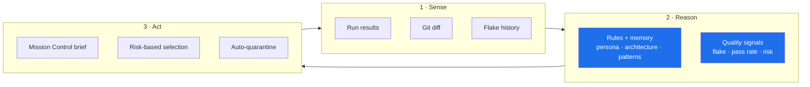

<div align="center">

# 🤖 TARS

### Test Automation & Reliability System

**An autonomous quality-engineering agent that builds, runs, and reasons about
the test suite — encoded as living rules, shipping real intelligence today.**

</div>

---

## The idea

A principal SDET's value isn't typing tests — it's _judgment_: knowing what to
test, spotting flake before it spreads, reading a run and saying "ship it" or
"stop." TARS captures that judgment as a system: **rules that govern how the
suite is built** plus **engines that act on every run**. It doesn't replace the
engineer; it does the 10x of the busywork so the engineer does the thinking.

This is built the way you'd build a product, not a demo: ship a working core,
be honest about what's next, and never claim a capability that isn't running.

## Shipped today

| Capability               | What it does                                                                                                                                                                                                                                          | Where                                                                                                            |
| ------------------------ | ----------------------------------------------------------------------------------------------------------------------------------------------------------------------------------------------------------------------------------------------------- | ---------------------------------------------------------------------------------------------------------------- |
| **Mission Control**      | Custom Playwright reporter — turns every run into intelligence: pass rate, **flake detection** (passed-only-on-retry), slowest paths, breakdown by project/tag. Writes a Markdown brief + machine-readable JSON. Defensive: it can never break a run. | [`reporter/TarsReporter.ts`](./reporter/TarsReporter.ts)                                                         |
| **Risk-based selection** | Maps changed files in a diff to the smallest set of affected specs (test-impact analysis) so a PR runs only what matters. Escalates to the full suite on core/shared/config changes.                                                                  | [`engine/select.ts`](./engine/select.ts)                                                                         |
| **Auto-quarantine**      | Folds a run's flaky tests into a committed, deduplicated ledger tracking flake count and first/last-seen — closing the loop from detection to triage.                                                                                                 | [`engine/quarantine.ts`](./engine/quarantine.ts)                                                                 |
| **Governance engine**    | Three steering docs that hold every change — human or AI — to a principal bar: typed code, deterministic tests, clean commits, honest tradeoffs. Loaded as context on every interaction.                                                              | [`persona.md`](./persona.md) · [`architecture.md`](./architecture.md) · [`test-patterns.md`](./test-patterns.md) |

```bash
npm run tars:select        # which tests does this diff actually affect?
npm run tars:quarantine    # fold the last run's flakes into the ledger
# Mission Control runs automatically on every `playwright test`.
```

Every run, TARS reports:

```
┌─ 🤖 TARS Mission Control ─────────────────────────────
│ 🟢 ALL SYSTEMS GREEN
│ Pass 100.0% (28/28)  ·  Flake 0.00%  ·  Fail 0  ·  3.7s
│ Brief written to tars-report.md
└───────────────────────────────────────────────────────
```

## Architecture — the agent loop

TARS follows the classic autonomous-agent loop, grounded in real tooling rather
than buzzwords:



- **Sense** — ingest test results/retries, the git diff, and the flake ledger.
- **Reason** — apply the governing rules and quality signals; decide what
  matters.
- **Act** — emit the brief, select the affected tests, quarantine the flakes.

## Capability roadmap

Honest status — `✅` runs today, `◐` in design, `○` planned. Each maps to an
industry best practice a senior QE team would recognise.

| Capability                                     | Best practice                     | Status |
| ---------------------------------------------- | --------------------------------- | ------ |
| Run intelligence brief (pass/flake/slowest)    | Observability-driven QE           | ✅     |
| Flake detection from retries                   | Flake <1% culture                 | ✅     |
| Risk-based test selection from git diff        | Test-impact analysis              | ✅     |
| Auto-quarantine ledger                         | Deterministic CI                  | ✅     |
| Governance rules as living docs                | Shift-left, code-review-as-config | ✅     |
| Trend memory across runs (history + dashboard) | SLO dashboards                    | ◐      |
| CI wiring of selection + quarantine            | Faster pipelines                  | ◐      |
| Failure triage: correlate trace + logs         | MTTR reduction                    | ○      |
| MCP server — TARS as a callable agent tool     | Agent-native tooling              | ○      |
| Self-healing locator suggestions               | AI-augmented authoring            | ○      |
| PR review bot (rules + diff)                   | Quality gate automation           | ○      |

## Principles (the honesty setting)

TARS is built to push back, not comply. From this project's actual history:

- **Deferred `mergeTests`** — no real consumer, so it wasn't added as dead code.
- **Swapped Vitest → Jest** for Pact mid-build — wrong runner, called it out.
- **Baselined a real WCAG defect** instead of ignoring it — the a11y engine
  caught a genuine `select-name` violation in the target app.
- **Kept visual tests out of gated CI** — OS-specific baselines would cause
  false failures; documented the tradeoff instead of hiding it.

---

<div align="center">

**Rules govern. Engines act. The engineer decides.**

← back to the [framework README](../README.md)

</div>
